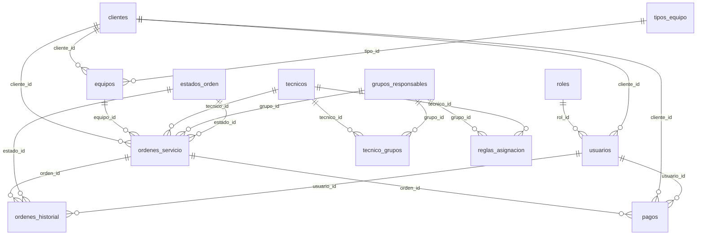

# Database Documentation

This document describes the database schema for the RepairEquipment system.

## ER Diagram (Mermaid)

## Tables and Purpose

- `roles`: User roles (Administrator, Technician, Reception).
- `usuarios`: System users (login credentials and role).
- `clientes`: Customers who own equipment.
- `tecnicos`: Technicians who repair equipment.
- `grupos_responsables`: Responsible groups or areas.
- `tecnico_grupos`: Many-to-many relation between technicians and groups.
- `reglas_asignacion`: Keyword-based rules (comma-separated keywords) to suggest group/technician.
- `tipos_equipo`: Catalog of equipment types.
- `equipos`: Customer equipment registry.
- `estados_orden`: Order status catalog.
- `ordenes_servicio`: Repair service orders.
- `ordenes_historial`: Status changes history per order.
- `pagos`: Payments associated to service orders.

## Key Relationships

- `usuarios.rol_id` → `roles.id`
- `usuarios.cliente_id` → `clientes.id`
- `equipos.cliente_id` → `clientes.id`
- `equipos.tipo_id` → `tipos_equipo.id`
- `ordenes_servicio.cliente_id` → `clientes.id`
- `ordenes_servicio.equipo_id` → `equipos.id`
- `ordenes_servicio.tecnico_id` → `tecnicos.id`
- `ordenes_servicio.grupo_id` → `grupos_responsables.id`
- `ordenes_servicio.estado_id` → `estados_orden.id`
- `ordenes_historial.orden_id` → `ordenes_servicio.id`
- `ordenes_historial.estado_id` → `estados_orden.id`
- `ordenes_historial.usuario_id` → `usuarios.id`
- `pagos.orden_id` → `ordenes_servicio.id`
- `pagos.cliente_id` → `clientes.id`
- `pagos.usuario_id` → `usuarios.id`
- `tecnico_grupos.tecnico_id` → `tecnicos.id`
- `tecnico_grupos.grupo_id` → `grupos_responsables.id`
- `reglas_asignacion.grupo_id` → `grupos_responsables.id`
- `reglas_asignacion.tecnico_id` → `tecnicos.id`

## Notes

- `ordenes_historial` preserves the lifecycle of each repair order.
- Deleting a `cliente` or `equipo` is restricted if they are referenced by orders.
- Deleting a `tecnico` is allowed if set to NULL in related orders.
